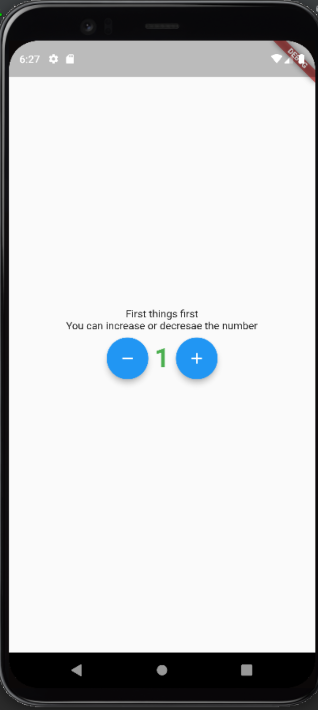
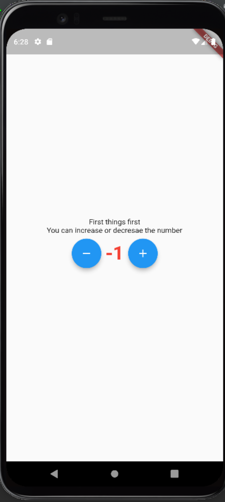

# First Bloc Implementation Try
By creating this easy project, I understood the basics of Bloc
Added two different statees that displays two differenet colors

Increment -> Green Color

Increment -> Green Color
